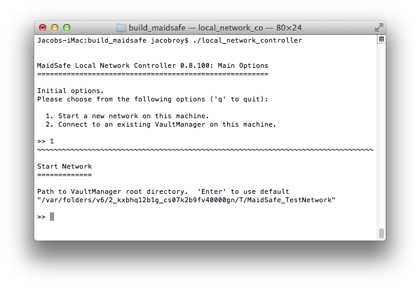
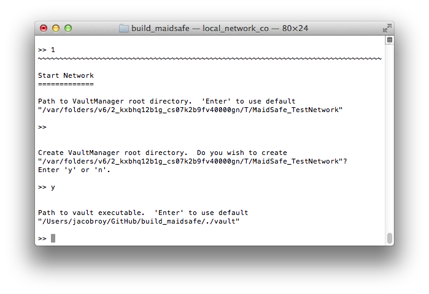
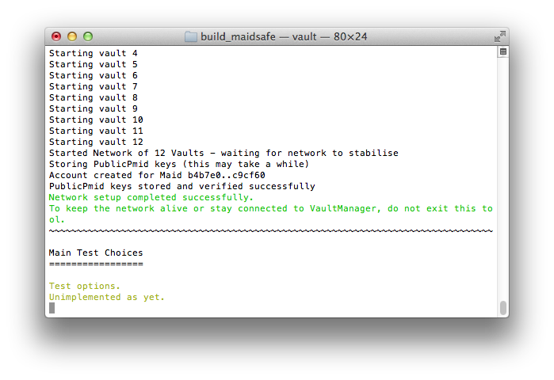

# Configuration du réseau local

Maintenant que vous avez configuré l'environnement de compilation, la cible requise pour cet exemple est '**local_network_controller**'. Celle-ci est utilisée en tant que client pour se connecter au « Vault Manager » et lancer le réseau avec un certain nombre de Vaults desquels on peut se connecter dans de futures exemples.

* Compilez la cible 'local_network_controller' (Sur Unix, make local_network_controller)
* Lancez l'outil (local_network_controller) et vous devriez voir quelque chose comme cela:

> Tip: Si vous voulez voir un log plus détaillé, vous pouvez ajouter `--log_* V` en lançant l'outil. Consultez [cette page wiki](https://github.com/maidsafe/MaidSafe/wiki/Logging-Options#invoking-logging-arguments) pour des options de log plus complètes.

Pour cet exemple, nous allons choisir l'option 1. Tapez `1` et la touche Enter. Cela nous laisse créer un nouveau réseau sur cette machine.

Vous pouvez utiliser des paramètres personnalisés, où applicable, pour de nombreuses options dans l'outil. Par exemple, "Path to vault Executable" (chemin vers l'éxecutable des vault) ou "Number of Vaults to run the network with" (nombre de vaults à lancer sur le réseau local). Suivant les options par défaut, vous devriez voir l'outil fonctionner comme ceci:

En utilisant les options par défaut pour le nombre de Vault, l'outil configure le réseau avec 12 Vaults. Il y a deux Vaults d'extra (zero state nodes) qui sont créées pendant le processus, et seront détruite pendant la phase de bootstrap.

Le problème est que pour les réseaux tout neuf (zero state), les Vaults ne sont pas capables de valider à qui elles sont connectées car aucune Vaults ne s'est encore enregistrée sur le réseau. L'enregistrement d'une vault sur le réseau demande le stockage de la clé publique de cette Vault sur le réseau. Évidemment, ceci ne peut pas se produire *avant* que le réseau n'existe !

Pour contourner ce problème, nous créons un ensemble de clés (une par Vault) avant de lancer le réseau. Le « Vault Manager » distribue la liste complète de clés à toutes les Vaults avant le lancement. Ainsi, les Vaults peuvent tricher et avoir toutes les clés à partir de la liste au lieu d'à partir du réseau.

Tout de suite après que le réseau soit lancé, l'outil va stocker les clés publiques proprement sur le réseau. À partir de là, le réseau peut fonctionner normalement.

Chaque Vault à besoin d'être connectée à un nombre minimum de Vaults avant de se considérer commme faisant partie du réseau. C'est pour cette raison que l'outil demande un minimum de 10 Vaults pour un réseau local.

Si tout fonctionne bien, vous devriez recevoir le message suivant :

Comme l'explique le message, il faut garder l'outil en marche pour maintenir le réseau de test opérationnel sur cette machine.

C'est maintenant la fin de cet exemple, si vous lisez ceci nous espérons que vous avez réussi à lancer le réseau de test sur votre machine, bravo!
