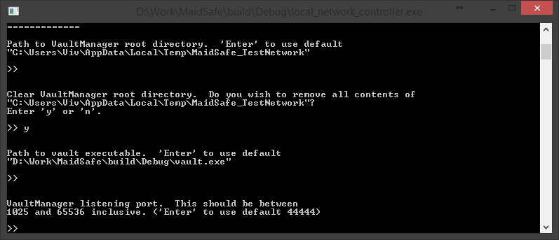
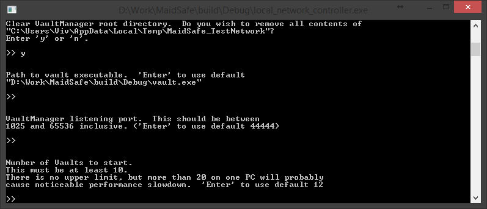

# Yerel Ağ Kurulumu

Derleme ortamı bilgisayarınızda artık mevcut olduğuna göre, bu örnekteki hedefimiz '**local\_network\_controller**'. Bu, kasa yöneticisine bağlanmak için bir istemci görevi görerek daha sonraki örneklerde bağlanabileceğimiz birkaç kasa ile birlikte ağın başlatılmasını sağlar.

* `local_network_controller` hedefini derle

 #### Unix Makedosyaları:
MaidSafe Süper proje'nizin build dizininde şunu çalıştırın

      make local_network_controller

 #### MSVC / XCode:
`local_network_controller` hedefini MaidSafe Süper proje'nizin proje çözüm dosyası/xcodeproj dosyası üzerinden derleyebilirsiniz.

* Aracı çalıştırın ve simdi aşağıdaki gibi bir mesaj görmeniz gerekiyor:

> İpucu: Eğer detaylı kayıt bilgisi görmek isterseniz, aracı çağırırken `--log_* V` parametresini kullanabilirsiniz.  Tüm kayıt seçeneklerini görmek için, [bu wiki sayfası](https://github.com/maidsafe/MaidSafe/wiki/Logging-Options#invoking-logging-arguments)na bakınız.

Bu örnekte "1" nolu seçenekle devam edeceğiz. "1"e basın ve Enter deyin. Bu, bizim bu makine üzerinde yeni bir ağ başlatmamızı sağlayacak.

"Kasa Uygulamasının Yolu" ya da "Ağı çalıştırmak için başlangıç Kasa sayısı" gibi çeşitli seçenekler için araç içerisinde özel ayarlamalar yapabilirsiniz. Varsayılan seçenekleri takip ederseniz, aracın aşağıdaki gibi işlem yaptığını göreceksiniz

Şimdi araç, "Kasa sayısı" için varsayılan seçenek olan 12 Kasayla ağı kuracak (**bu işlem birkaç dakika sürebilir**). Burada başlangıç aşaması sırasında işlemin bir parçası olarak oluşturulan ve yok edilen 2 ekstra kasa (sıfır durumu düğümleri) bulunmakta.

Buradaki sorun, tümüyle yeni bir (örn. "sıfır durumundaki") ağda, Kasaların kiminle bağlantı kurduklarını doğrulayamamalarıdır, çünkü ortada kendisini ağa başarıyla kaydedebilen bir Kasa bulunmamaktadır. Kasa kaydı, Kasa'nın açık anahtarlarının ağa depolanmasını gerektirir - ki bu da ağ mevcut olmadan *önce* gerçekleşemez!

Bunun üstesinden gelmek için, ağ başlamadan önce bir parça (kasa başına bir) anahtar oluşturuyoruz ve kasa yöneticisi tüm listeyi başlattığı her bir Kasaya dağıtıyor. Dolayısıyla Kasalar hile yapıyor ve ilk eşlerinin anahtarlarını ağdan almak yerine bu listeden alabiliyor.

Ağ başladıktan sonra, araç, açık anahtarları ağa uygun bir şekilde depolama aşamasına geçiyor ve artık bu aşamada ağ normal olarak davranabilir.

Her bir Kasa kendisini ağa katılmış sayabilmek için en az belirli bir sayıda eş Kasaya bağlı olmak zorundadır. Bu nedenle araç belirli bir en düşük ağ boyutunu zorlar (şu anda 10).

Herşeyin düzgün çalıştığını varsayarsak, şimdi aşağıdaki gibi bir şey görmeniz gerekir:

Ekran görüntüsündeki bu mesajın anlattığı gibi, bu makinede test ağını açık tutmak icin aracı çalışır durumda bırakmamız gerekir. Böylece bu Örneğin sonuna gelmiş bulunuyoruz. Eğer bunu okuyorsanız, umarız makinenizde çalışan bir test ağı kurabilmiş oldunuz, öyleyse tebrikler!!
